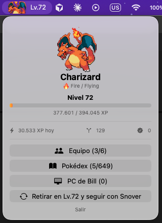

# Train Your Pokémon

Turns your Claude Code work into a Pokémon that levels up and evolves, shown in
the macOS menu bar and in the Claude Code status line. Tokens and commits both
earn XP. Retire it whenever you like and it goes into Bill's PC at the level it
reached, or push it to 100 for the badge — the pace of the collection is yours.
Nothing stored there is final: pull one back out and keep raising it.



```
statusline  🌿 main  |  🤖 Opus 5 [high]  |  🔥 Charizard Lv.82 [████████░░] 84%
```

No dependencies beyond what macOS ships: the engine is stdlib-only Python, the
menu bar app is SwiftUI built with the Command Line Tools, and sprites, cries
and evolution data come from [PokéAPI](https://pokeapi.co).

## How it works

Claude Code writes a JSONL transcript per session under `~/.claude/projects/`.
The engine reads those incrementally, turns token usage and commits into XP, and
writes a single state file that both frontends read.

```
~/.claude/projects/*.jsonl
          │
          ▼
  engine/poketrainer.py  ──▶  ~/.claude/pokemon-state.json
                                        │
                        ┌───────────────┴───────────────┐
                        ▼                               ▼
                 menu bar app                    Claude Code
                 (SwiftUI)                       status line
```

## Earning XP

Two sources feed the same Pokémon, split by how often each happens.

| Source | Rate | Reward |
|---|---|---|
| Work tokens | continuous | 1 XP per 50 tokens |
| Commits | ~9 a day | 2,000 XP each |
| New project | a few a year | a Pokémon of your choice |

Commits grant XP rather than Pokémon on purpose. At nine a day, awarding a
Pokémon per commit would bury the PC under level-1 entries nobody trained and
drown the ones actually raised — the collection has to stay a record of what was
trained, so training is the only route into it.

Starting a brand new project does grant one, because it happens rarely enough to
stay meaningful. Those are stored with their source and shown as *Obtenido*
rather than a level, so an awarded Pokémon never passes for a trained one.

Commits are counted from the transcript itself, not from git, so no repository
needs a hook and every project counts automatically.

## Setting your own pace

Retiring stores the active Pokémon at whatever level it reached and starts the
next one. Level 100 is a badge, not a requirement — in the games you fill the
collection by catching, and nobody maxes 151 Pokémon.

| Retire at | Each takes | Per year | 328 species in |
|---|---|---|---|
| Lv.40 | ~1 active day | ~183 | 1.8 years |
| Lv.50 | ~2 active days | ~88 | 3.7 years |
| Lv.60 | ~3.7 active days | ~49 | 6.7 years |
| Lv.100 | ~18 active days | ~10 | with the ★ badge |

The floor is level 40, and it is measured rather than picked: sampling 120
chains, **98% have fully evolved by level 40** and the median last evolution is
34.5. Anything above that is watching a number grow with no new form to see. A
floor is needed at all because without one the whole roster could be retired at
level 1 in an afternoon.

### A team of six

Retiring is final, so it is the wrong tool for losing interest in a Pokémon
halfway up. The team is the other one: up to **six at a time**, of which only the
one being trained earns XP. The rest sit benched, frozen at exactly the level and
XP they were parked with, and come back unchanged whenever you pick them up
again.

Nothing is duplicated or lost by rotating — the XP a day produces is the same, it
just goes wherever you pointed it. What the six slots buy is the pressure that
keeps the team from becoming storage: filling the last slot means retiring
someone first, and retiring still needs level 40. Without a limit a dozen
Pokémon would sit at level 5 forever and the collection would never grow.

Retiring with someone on the bench asks what should happen to the slot it
leaves. Promoting whoever is next frees it, which is how the team shrinks;
starting a new species instead keeps the team the same size and leaves the
retired one waiting in the PC. An earlier version promoted silently, and that
quietly capped the team at two — the only way to add a member is for a new
Pokémon to enter the world, and promoting never creates one.

A slot is filled from the PC and nowhere else. The panel will not hand out a
fresh species on request, because that would bypass both routes that make
getting a Pokémon mean something — retiring one at the floor, or being awarded
one for starting a project — and turn the roster into something asked for rather
than earned.

Starting a new species costs progress: a Pokémon that has not gained a level
since it was last put in the PC has achieved nothing to be paid for, and the
option is refused. Without that, one already-trained Pokémon could be retired and
withdrawn over and over, filling the team with free level-1 species while earning
no XP at all. Promoting the bench is never gated, because it hands out nothing.

So the team grows by one for every **level gained past the last time a Pokémon
was filed**, with no separate currency to track:

```
train to Lv.40 → retire, start a new species → the trained one waits in the PC
                                                        │
                                            take it back out → the team is one bigger
```

Starting fresh with a species the panel does not offer is still possible from
the command line (`party <id>`), which exists for setting up a state rather than
for playing.

With a full team, and only then, any member can be put in the PC at whatever
level it is. That is the way out of a team filled by accident: freeing a slot
otherwise needs level 40, so a couple of mis-taps could lock the team for days.

Depositing skips the floor without cheapening it, because it does not make a
collection entry. A deposited Pokémon is marked *stored* rather than *trained*
and is left out of the caught count — it is parked, not finished. Take it back
out, raise it past the floor and retire it, and only then does it count.

### Bill's PC

Retiring is not the end of a Pokémon, only the end of a stint. Stored Pokémon can
be pulled back out and put on the team, resuming at the level they went in at.
The entry leaves the PC while it is being trained and returns on the next
retirement, at whatever level it reached by then — so one chain still yields
exactly one entry and cycling a Pokémon in and out duplicates nothing.

Entries filed before this existed keep only species, level and shininess, so the
rest of the record is derived on the way out: the chain from the species, the XP
from what that level is worth on its curve, and the branch it took from the form
it was stored as. Partial progress towards the next level was never recorded, so
it comes back at exactly its level's threshold. Everything stored from now on
keeps its whole record and returns untouched.

Awarded Pokémon can be trained too. One starts at level 1 marked *Obtenido*, and
if it is taken out and raised, retiring it files it as trained at the level it
actually reached.

### What you can train

**328 base forms**, the starting point of every evolution chain in generations I
to V. The other species in those generations are reached by levelling, not by
picking — you get Charizard by raising a Charmander.

The cap is species 649. That is where the animated pixel sprites stop (from 650
only 475px official artwork exists, which sits badly beside pixel art) and it is
also exactly the end of generation V — the two boundaries happen to coincide.
PokéAPI itself carries 1025 species across 541 chains.

## Shiny Pokémon

Rolled once when a species starts being trained or is claimed, never on
evolution — shininess is inherited, so a shiny Charmander yields a shiny
Charizard. Purely cosmetic, marked with ✨ in the panel and the PC.

The odds are **1 in 45**, which lands near four a year at the ~183 encounters
that retiring at the floor produces. Retire higher and you will see fewer, which
is the trade rather than a flaw: hunting shinies costs collection quality. The
games use 1/8192, which at this cadence means never.

## The interesting parts

**Not all tokens are work.** `cache_read` accounts for ~98% of raw token volume
and grows with context length rather than with effort, so counting it would put
any Pokémon at level 100 on day one. XP comes from `output_tokens +
cache_creation_input_tokens` only.

**The transcript repeats itself.** Claude Code writes one line per content block
and each line carries the full `usage` payload, so naive summing inflates totals
by ~2.5x. Everything is deduplicated by `message.id`.

**Not every evolution has a level.** PokéAPI returns `min_level: null` for
evolutions triggered by stones, trade or friendship, so without a fallback Eevee,
Pikachu and Kadabra would never evolve at all. Those land on level 40. Chains
with several such hops cannot all sit there, so they are spread evenly ending at
40: Pichu's two become 20 and 40.

**Branching chains wait for you.** Eevee has eight forms, and evolving into
whichever one PokéAPI happens to list first would make the choice an illusion.
On reaching the level the engine stops and records the options; the panel shows
them and picking one is what evolves it.

**The status line runs several times per second.** It never invokes the engine;
it reads a pre-rendered tab-separated line with bash's `read` builtin. An earlier
version shelled out to `jq` and cost 41ms per redraw.

**Menu bar icons are 24pt tall.** A whole sprite scaled to fit is unreadable, so
the icon crops to the Pokémon's face and scales that up. Gen-5 sprites are
pre-normalised to a near-square box (Onix is drawn coiled, not tall), so the
framing generalises across body plans by anchoring the crop a third of the way
down — top-anchoring cuts the eyes off quadrupeds.

**Cries play without a converter.** PokéAPI serves them as Ogg Vorbis, which
macOS CoreAudio decodes natively, so `afplay` handles them directly.

## Install

Requires macOS 13+ and Xcode Command Line Tools (`xcode-select --install`).
Full Xcode is *not* needed — a WidgetKit widget would require it, a
`MenuBarExtra` app does not.

```bash
git clone https://github.com/fsotomutoli/train-your-pokemon.git
cd train-your-pokemon

python3 engine/poketrainer.py backfill   # convert your history into XP
bash app/build.sh                        # build the menu bar app
bash install.sh                          # start it, and start it at login
```

To show your Pokémon in the Claude Code status line as well, see
[`docs/statusline.md`](docs/statusline.md).

## Commands

```bash
python3 engine/poketrainer.py scan               # incremental update (~0.1s)
python3 engine/poketrainer.py backfill           # re-read all history
python3 engine/poketrainer.py status             # dump state as JSON
python3 engine/poketrainer.py candidates         # list species you can train
python3 engine/poketrainer.py party 7            # add #7 to the team and train it
python3 engine/poketrainer.py switch 95          # bench the current, resume #95
python3 engine/poketrainer.py withdraw 6         # take #6 out of the PC and train it
python3 engine/poketrainer.py deposit 152        # park a team member in the PC
python3 engine/poketrainer.py retire             # file it, promote the bench
python3 engine/poketrainer.py retire 4           # file the current one, train #4
python3 engine/poketrainer.py choose 4 --keep-xp # switch, carrying XP over
python3 engine/poketrainer.py evolve 197         # pick a form on a branching stage
python3 engine/poketrainer.py claim 25           # spend a new-project reward
python3 engine/poketrainer.py cry                # play the current cry
python3 engine/poketrainer.py test-notification  # queue a test banner
```

## Tuning

Pace and rewards live at the top of `engine/poketrainer.py`:

```python
TOKENS_PER_XP      = 50     # lower = faster levelling
COMMIT_XP          = 2000   # XP per commit
MIN_RETIRE_LEVEL   = 40     # lowest level a Pokemon may be retired at
PARTY_SIZE         = 6      # team slots, the active Pokemon included
SHINY_CHANCE       = 45     # one in N new Pokemon is shiny
MAX_SPECIES_ID     = 649    # end of gen V, where animated sprites stop
FIXED_EVO_LEVEL    = 40     # for evolutions PokeAPI gives no level
BACKFILL_MAX_LEVEL = 60     # ceiling on XP granted by replaying history
```

At these values roughly 17 active days of heavy use reach level 100, and about a
third of XP comes from commits rather than tokens. Adjust to taste, then re-run
`backfill`.

`MIN_RETIRE_LEVEL` and `SHINY_CHANCE` are coupled: lowering the floor multiplies
how often you retire, and the shiny rate is per new Pokémon. Halve the floor's
cost and you double the shinies.

`BACKFILL_MAX_LEVEL` matters more than it looks. Without a ceiling, replaying a
long history hands the very first Pokémon a nearly free run to 100 and makes
every later one feel like a wall.

Menu bar framing lives in `app/Sources/Sprites.swift`:

```swift
static let canvasHeight: CGFloat = 24   // icon height
static let headFraction: CGFloat = 0.58 // how much of the sprite is framed
static let cropAnchor:   CGFloat = 0.34 // where the crop window sits
static let maxWidth:     CGFloat = 36   // widest the sprite may get
static let trailingGap:  CGFloat = 6    // space before the level text
```

`app/preview.swift` renders icons to a contact sheet so framing can be checked
without screenshotting the menu bar.

## A caveat worth naming

Anything that rewards token usage nudges you toward burning tokens for the
dopamine, which is not obviously a good thing. Paying for commits softens it —
a commit is an outcome rather than spend, and at the default rates roughly a
third of XP comes from work — but it does not remove it. A daily XP cap would,
and is deliberately not implemented. Decide for yourself.

## License

MIT. Pokémon and its sprites, names and cries are trademarks of Nintendo /
Creatures Inc. / GAME FREAK Inc.; this is an unofficial fan project with no
affiliation, distributed for personal use.
